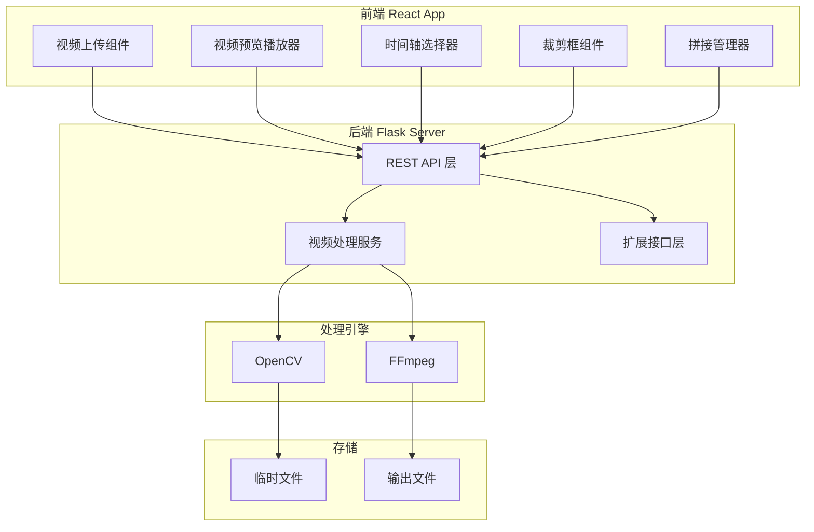
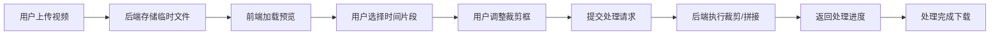

## 产品概述

一款专业的视频裁剪与拼接网页应用，支持用户上传视频文件，通过直观的时间轴选择视频片段，并使用自由拖拽的像素裁剪框进行画面区域裁剪。后端采用 OpenCV/FFmpeg 进行高效视频处理，同时预留特征点跟踪等高级功能扩展接口，为后续智能裁剪功能开发奠定基础。

## 核心功能

- **视频上传管理**：支持主流视频格式上传，显示上传进度，支持文件预览和管理
- **时间轴片段选择**：可视化时间轴组件，支持拖拽选择视频起止时间点，精确到帧级别的片段截取
- **像素裁剪框**：在视频预览区域叠加可自由拖拽、调整大小的裁剪框，实时显示裁剪区域像素坐标和尺寸
- **视频拼接**：支持多个视频片段按顺序拼接，可调整片段顺序
- **视频处理与导出**：后端调用 OpenCV/FFmpeg 执行裁剪拼接操作，支持处理进度查询和结果下载
- **扩展接口预留**：为特征点跟踪、智能裁剪等后续功能预留标准化 API 接口

## 技术栈

- **前端框架**：React + TypeScript + Less + TDesign 组件库
- **后端框架**：Python Flask（已有）
- **视频处理**：OpenCV + FFmpeg
- **文件存储**：本地文件系统（可扩展至云存储）

## 技术架构

### 系统架构

采用前后端分离架构，前端负责视频预览和交互操作，后端负责视频处理任务执行。



### 模块划分

**前端模块**

- **VideoUploader**：视频上传组件，处理文件选择、上传进度、格式校验
- **VideoPlayer**：视频预览播放器，支持播放控制和帧定位
- **TimelineSelector**：时间轴选择器，可视化选择视频片段
- **CropOverlay**：裁剪框覆盖层，支持拖拽和调整大小
- **MergePanel**：拼接管理面板，管理多个视频片段

**后端模块**

- **UploadAPI**：文件上传接口，处理大文件分片上传
- **VideoProcessor**：视频处理核心，封装 OpenCV/FFmpeg 操作
- **TaskManager**：任务管理器，处理异步任务状态
- **ExtensionInterface**：扩展接口层，预留特征点跟踪等功能入口

### 数据流



## 实现细节

### 核心目录结构

```
project-root/
├── frontend/
│   ├── src/
│   │   ├── components/
│   │   │   ├── VideoUploader/
│   │   │   │   ├── index.tsx
│   │   │   │   └── index.less
│   │   │   ├── VideoPlayer/
│   │   │   │   ├── index.tsx
│   │   │   │   └── index.less
│   │   │   ├── TimelineSelector/
│   │   │   │   ├── index.tsx
│   │   │   │   └── index.less
│   │   │   ├── CropOverlay/
│   │   │   │   ├── index.tsx
│   │   │   │   └── index.less
│   │   │   └── MergePanel/
│   │   │       ├── index.tsx
│   │   │       └── index.less
│   │   ├── pages/
│   │   │   └── Editor/
│   │   │       ├── index.tsx
│   │   │       └── index.less
│   │   ├── services/
│   │   │   └── videoApi.ts
│   │   ├── types/
│   │   │   └── video.ts
│   │   └── utils/
│   │       └── timeFormat.ts
│   └── package.json
├── backend/
│   ├── app/
│   │   ├── __init__.py
│   │   ├── routes/
│   │   │   ├── upload.py
│   │   │   ├── process.py
│   │   │   └── extension.py
│   │   ├── services/
│   │   │   ├── video_processor.py
│   │   │   └── task_manager.py
│   │   └── utils/
│   │       └── ffmpeg_wrapper.py
│   └── requirements.txt
└── README.md
```

### 关键代码结构

**视频片段数据结构**

```typescript
// 视频片段接口定义
interface VideoClip {
  id: string;
  fileId: string;
  fileName: string;
  startTime: number;  // 秒
  endTime: number;    // 秒
  cropArea: CropArea | null;
  order: number;
}

// 裁剪区域接口
interface CropArea {
  x: number;      // 左上角X坐标（像素）
  y: number;      // 左上角Y坐标（像素）
  width: number;  // 宽度（像素）
  height: number; // 高度（像素）
}

// 处理任务接口
interface ProcessTask {
  taskId: string;
  status: 'pending' | 'processing' | 'completed' | 'failed';
  progress: number;
  resultUrl?: string;
}
```

**后端视频处理服务接口**

```python
# 视频处理服务类
class VideoProcessor:
    def crop_video(self, input_path: str, output_path: str, 
                   start_time: float, end_time: float,
                   crop_area: dict = None) -> bool:
        """裁剪视频片段"""
        pass
    
    def merge_videos(self, input_paths: list, output_path: str) -> bool:
        """拼接多个视频"""
        pass

# 扩展接口基类
class ExtensionInterface:
    def process(self, video_path: str, params: dict) -> dict:
        """扩展处理接口，供特征点跟踪等功能继承实现"""
        raise NotImplementedError
```

### 技术实现方案

**1. 可拖拽裁剪框实现**

- 使用 React 实现可拖拽组件，监听鼠标事件计算位置偏移
- 四角和四边支持拖拽调整大小
- 实时显示裁剪区域的像素坐标和尺寸信息
- 限制裁剪框不超出视频画面边界

**2. 时间轴选择器实现**

- 基于视频时长渲染时间刻度
- 双滑块选择起止时间点
- 与视频播放器联动，支持预览选中片段

**3. 后端视频处理**

- 使用 FFmpeg 进行视频裁剪和拼接
- OpenCV 用于帧级别操作和扩展功能
- 采用异步任务队列处理耗时操作
- 提供任务状态查询接口

### 扩展接口设计

```python
# 扩展接口路由
@extension_bp.route('/api/extension/<method_name>', methods=['POST'])
def extension_handler(method_name: str):
    """
    预留扩展接口入口
    支持后续添加：特征点跟踪、智能裁剪、目标检测等功能
    """
    pass
```

## 技术考量

### 性能优化

- 大文件采用分片上传，支持断点续传
- 视频预览使用流式加载
- 后端处理任务异步执行，避免阻塞
- 前端裁剪框操作使用节流优化

### 安全措施

- 文件上传格式和大小校验
- 临时文件定期清理
- API 接口参数校验

## 设计风格

采用专业工具型设计风格，以深色主题为主，突出视频预览区域。界面布局清晰，操作区域分明，时间轴和裁剪框使用高对比度颜色确保可见性。整体风格简洁高效，符合视频编辑工具的专业定位。

## 页面设计

### 主编辑页面

**顶部导航栏**：左侧显示应用 Logo 和名称，右侧放置导出按钮和设置入口，背景使用深灰色。

**左侧素材面板**：宽度约 280px，展示已上传的视频文件列表，每个视频显示缩略图、文件名和时长，底部有上传按钮。

**中央预览区域**：占据主要空间，视频播放器居中显示，播放器上方叠加可拖拽的裁剪框，裁剪框使用蓝色边框和半透明填充。播放器下方显示播放控制条。

**底部时间轴区域**：高度约 120px，显示视频波形或帧缩略图，双滑块选择器用于标记起止时间，选中区域高亮显示。

**右侧属性面板**：宽度约 260px，显示当前裁剪框的坐标和尺寸信息，提供精确数值输入框，底部显示拼接片段列表，支持拖拽排序。